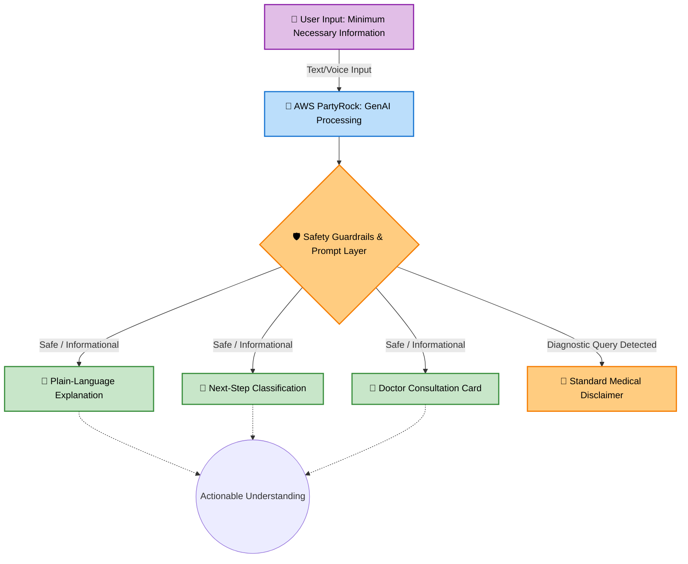

# 🌸 NIRA: Women's Menstrual Health Navigator

**Understand. Navigate. Prepare.**

*A private, multilingual AI health-navigation companion designed to bridge the gap between uncertainty and professional care.*

## 🚨 The Problem

Menstrual-health concerns are often accompanied by overwhelming uncertainty. When experiencing symptoms or changes, women frequently ask:
- *Is this normal?*
- *Should I be worried?*
- *When should I see a doctor?*
- *What should I even ask them?*

Traditional symptom checkers spit out terrifying medical jargon or misdiagnose, causing anxiety. **NIRA focuses on the uncertainty surrounding the symptom—not on diagnosing the symptom itself.**

## 💡 Our Solution: The NIRA Navigation Layer

NIRA acts as a **navigation layer** between a user's health uncertainty and professional medical care. We don't diagnose; we empower.

| Traditional Approach ❌ | NIRA's Approach ✅ |
| :--- | :--- |
| **"What disease do I have?"** | **"What should I understand?"** |
| Diagnosis-focused | Navigation-focused |
| Information overload | Action-oriented guidance |
| Generic, anxiety-inducing answers | Tailored consultation preparation |
| Symptom ➔ Diagnosis | Uncertainty ➔ Understanding ➔ Next Step |

### ✨ Key Features

- 🧠 **Plain-Language Understanding:** Translates complex health data into simple, digestible explanations.
- 🛡️ **Safety-First Navigation:** Classifies the best next step (Monitor, Consult a Doctor, or Seek Urgent Care).
- 📝 **Consultation Preparation:** Generates a personalized "Consultation Card" with exact questions to ask the doctor.
- 📊 **Symptom Tracking Guide:** Highlights exactly what patterns the user should track before their appointment.
- 🌐 **Multilingual & Accessible:** Supports English, Simple English, and Regional Languages (e.g., Telugu) for maximum inclusivity.

## 🏗️ Architecture & GenAI Workflow

NIRA is built iteratively on **AWS PartyRock**, utilizing prompt-chaining to ensure safety, accuracy, and clear outputs.

## 📜 Declaration of Originality

I, **Geethika Dasari**, hereby declare that this project, **NIRA**, submitted for the Aspire For Her × Logitech Women Who Master Hackathon 2026, is entirely my own original work. All application logic, prompts, presentation materials, and documentation were completed individually during the official hackathon window, and no unauthorized assistance was used.

📧 **Contact:** [geethikaadasari@gmail.com](mailto:geethikaadasari@gmail.com)
